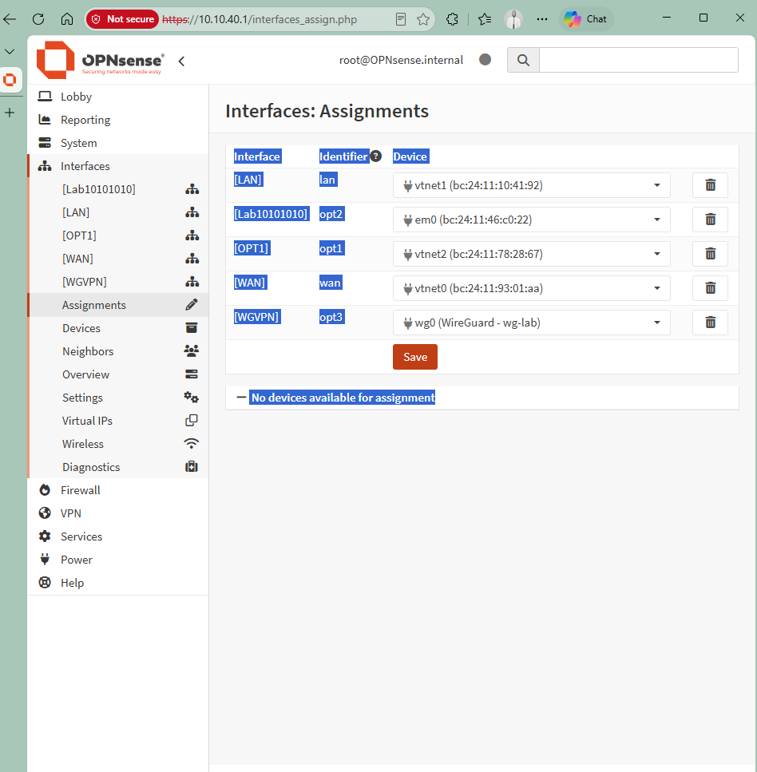
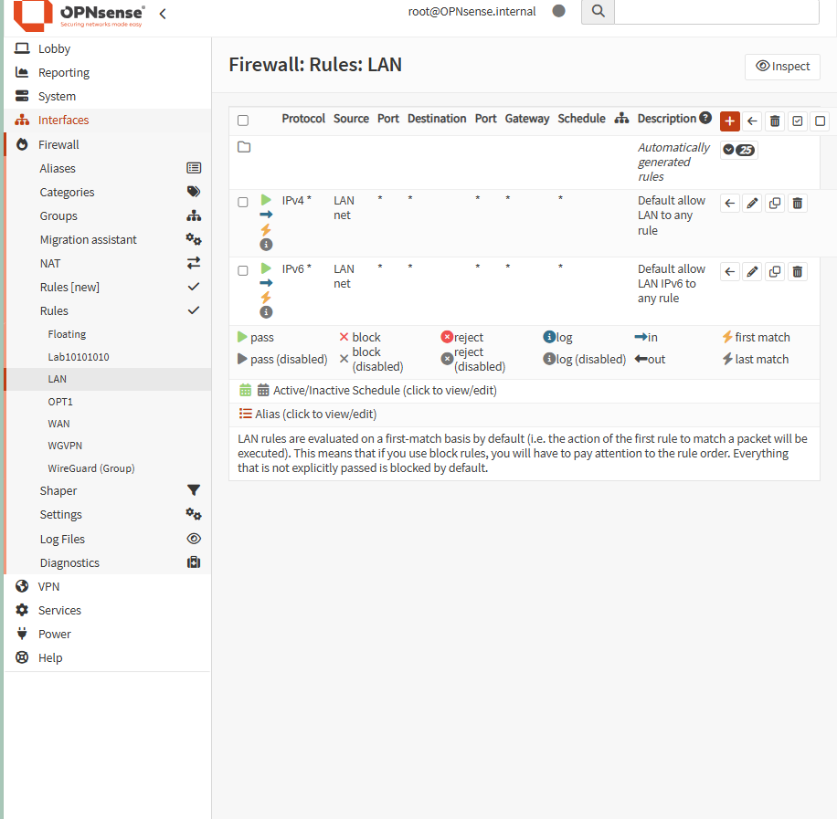
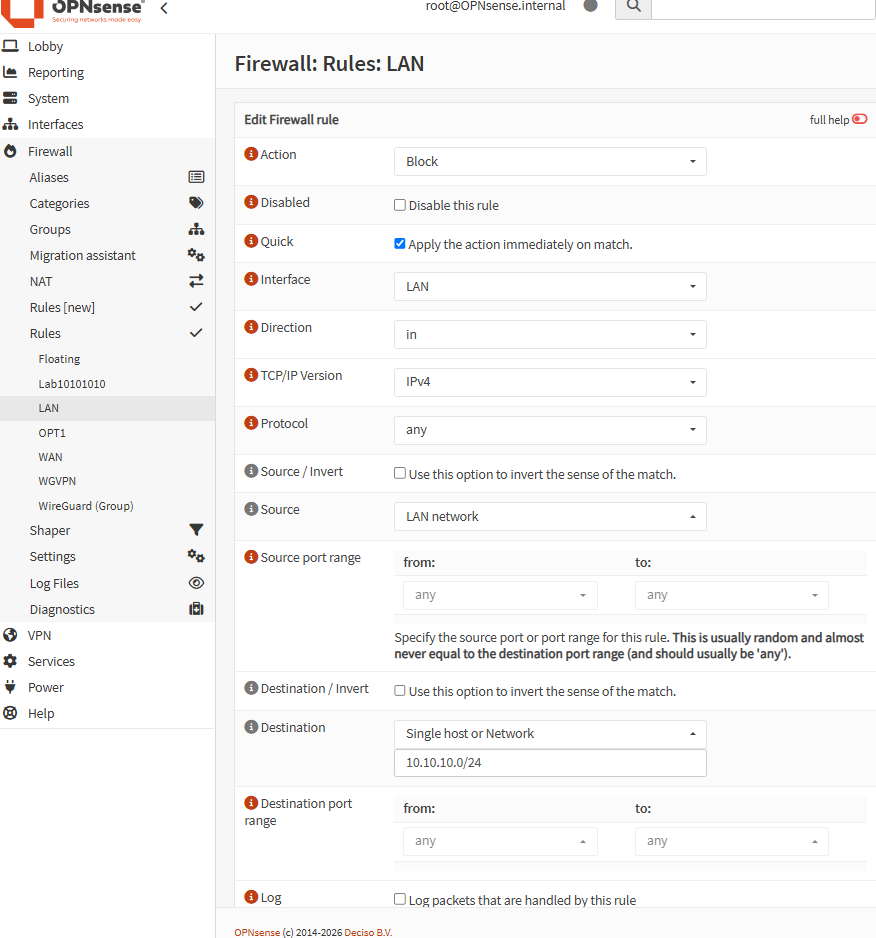
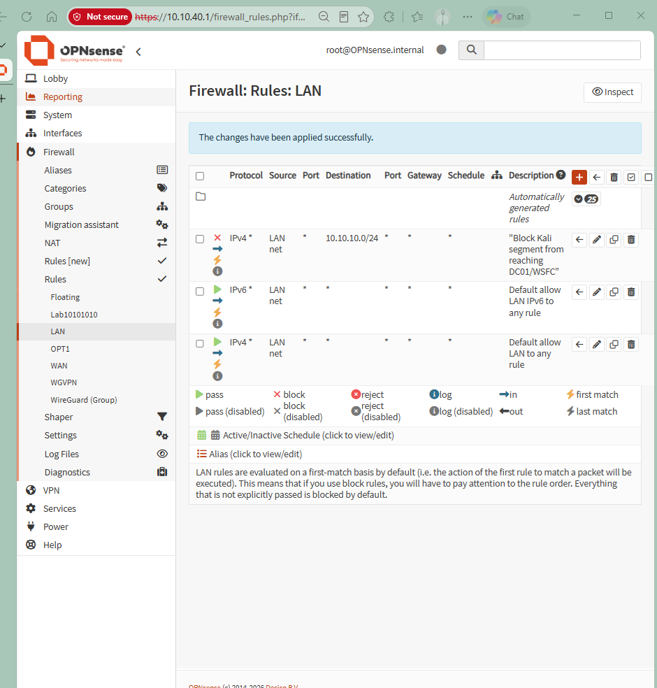
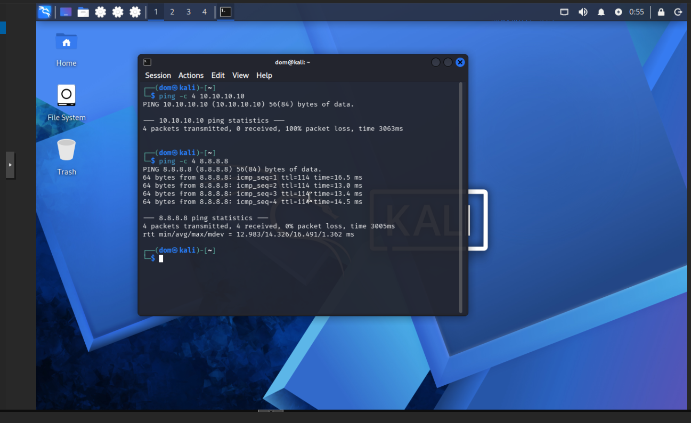
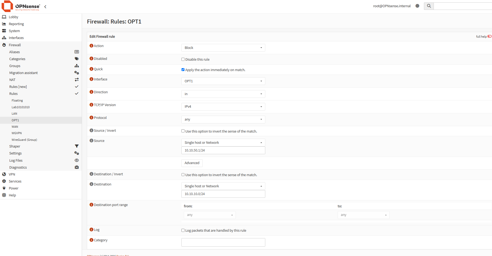
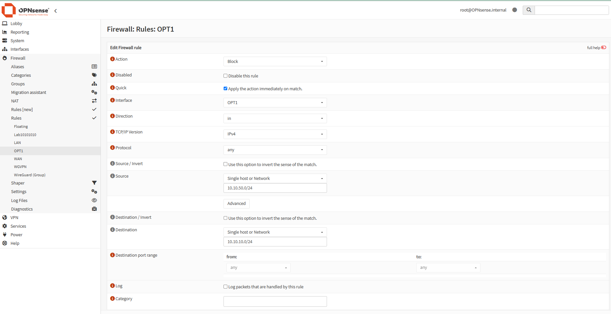
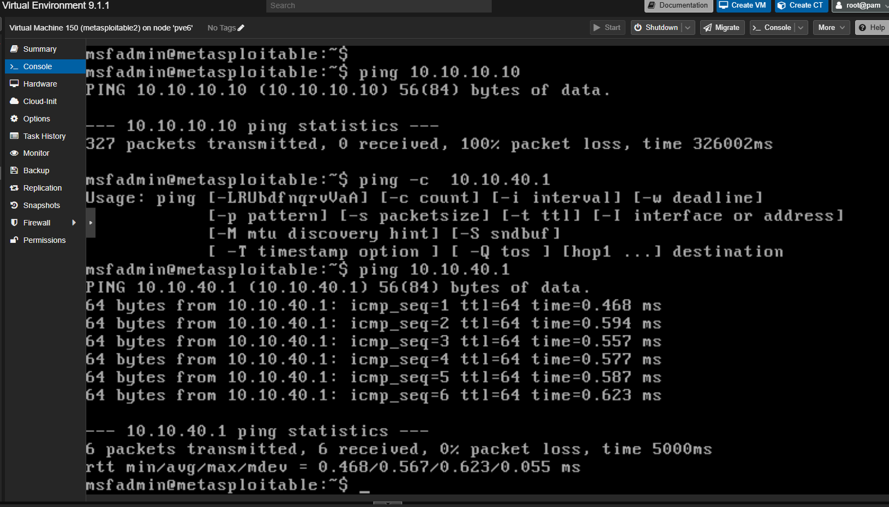

# OPNsense Network Segmentation — Isolating an Attack-Range Segment from Identity Infrastructure

Part of the [DOMLAB](https://github.com/Justdomi) homelab. This project implements and verifies
firewall-based network segmentation on OPNsense, isolating the lab's Kali/Metasploitable2 attack
range from the Active Directory / Windows Server Failover Cluster (WSFC) identity segment.

## Objective

DOMLAB runs several isolated network segments behind an OPNsense firewall/router:

| Segment | Subnet | Purpose |
|---|---|---|
| Lab10101010 | 10.10.10.0/24 | DC01 (Active Directory) + WSFC nodes — identity infrastructure |
| LAN (Kali) | 10.10.40.0/24 | Kali Linux — offensive security testing |
| OPT1 (Metasploitable2) | 10.10.50.0/24 | Metasploitable2 — intentionally vulnerable target host |

By default, OPNsense auto-generates a permissive "allow all" rule on every interface it creates.
That meant the attack-range segments (Kali, Metasploitable2) had unrestricted routed access to
the domain controller and failover cluster — the exact opposite of how a real attack-range or DMZ
segment should be isolated from production/identity systems.

**Goal:** explicitly block routed traffic from both attack-range segments into the identity
segment, while preserving each segment's normal connectivity everywhere else, and verify the
block with real traffic tests rather than just trusting the configuration.

## Why This Matters (Security 101)

This is a hands-on demonstration of a foundational security control: **network segmentation
enforced by default-deny logic**, applied at the firewall rather than assumed by topology alone.

Two concepts anchor this project:

- **Firewall rule evaluation is first-match, top-to-bottom.** A block rule placed *below* an
  existing allow-all rule will never fire — the allow-all rule matches first and the block is
  silently ineffective. Correct segmentation depends on rule *order*, not just rule *existence*.
- **Segmentation should be explicit, not incidental.** Having devices on separate VLANs/subnets
  does not, by itself, stop routed traffic between them — a router or firewall in the path will
  happily forward traffic across segments unless a rule says otherwise. This project makes that
  boundary real and enforced instead of assumed.

## Interface Mapping (Confirmed Before Making Any Changes)

Before writing any rule, the actual interface-to-subnet mapping was confirmed under
**Interfaces > Assignments** rather than trusted from labels alone — the interface literally
named "LAN" turned out to be the Kali segment (a leftover default name from setup), not a
general-purpose LAN. Verifying the real device/IP behind each label before touching firewall
rules avoided misconfiguring the wrong interface.



| OPNsense Label | Identifier | Actual Segment |
|---|---|---|
| LAN | lan | Kali (10.10.40.0/24) |
| Lab10101010 | opt2 | DC01 / WSFC (10.10.10.0/24) |
| OPT1 | opt1 | Metasploitable2 (10.10.50.0/24) |
| WAN | wan | Internet uplink |
| WGVPN | opt3 | WireGuard remote access |

## Before State — Default Permissive Rule

Each attack-range interface had only OPNsense's auto-generated default-allow rule — no
restriction on where traffic from that segment could go.



## Implementation

### Rule 1 — Block Kali → Identity Segment

Added an explicit **Block** rule on the LAN (Kali) interface, placed above the existing
default-allow rule:

- **Action:** Block, Quick (applies immediately on match — required so it takes effect before
  the allow-all rule below it is ever evaluated)
- **Source:** LAN net (10.10.40.0/24)
- **Destination:** 10.10.10.0/24 (Lab10101010 / identity segment)





### Verification — Kali

From Kali, tested reachability to the blocked destination and to an unrelated external address,
confirming the block is scoped to the intended destination only:

```
$ ping -c 4 10.10.10.10        # DC01 — expected to fail
--- 10.10.10.10 ping statistics ---
4 packets transmitted, 0 received, 100% packet loss

$ ping -c 4 8.8.8.8             # external — expected to succeed
--- 8.8.8.8 ping statistics ---
4 packets transmitted, 4 received, 0% packet loss
```



### Rule 2 — Block Metasploitable2 → Identity Segment

Same pattern, applied to the OPT1 (Metasploitable2) interface.

**A real mistake, left in deliberately:** the first attempt at this rule used
`10.10.50.1/24` as the source — a host address with a network-sized mask attached, rather than
the correctly-formed network address `10.10.50.0/24`. A `/24` mask matches the same address
range (10.10.50.0–10.10.50.255) regardless of which address it's written against — the mistake
wasn't scope, it was malformed notation (a specific host address paired with a network mask,
instead of the network's own base address).





### Verification — Metasploitable2

```
$ ping 10.10.10.10               # DC01 — expected to fail
--- 10.10.10.10 ping statistics ---
327 packets transmitted, 0 received, 100% packet loss

$ ping -c 6 10.10.40.1            # Kali's OPNsense interface — expected to succeed
--- 10.10.40.1 ping statistics ---
6 packets transmitted, 6 received, 0% packet loss
```



## Result

Both attack-range segments (Kali, Metasploitable2) are now explicitly denied routed access to
the identity infrastructure segment (DC01/WSFC), while retaining normal connectivity everywhere
else — confirmed with live traffic tests, not just configuration review.

## Key Takeaways

- **Rule order determines outcome.** A correct block rule in the wrong position (below an
  allow-all) is a no-op. This was verified explicitly, not assumed.
- **Block vs. Reject matters.** A blocked host receives no response at all (silent drop) rather
  than an explicit rejection — a deliberate security posture that gives a scanning attacker no
  confirmation that something is there and refusing them.
- **CIDR notation errors are easy to make and worth catching.** A host address with a network
  mask attached is malformed, even though it may appear to "work" depending on how a given
  firewall parses it — the network's own base address is the technically correct form.
- **Segmentation isn't proven by configuration — it's proven by testing.** Every rule in this
  project was verified with live ping tests from the actual segment being restricted, confirming
  both that the block works and that it doesn't over-block unrelated traffic.
