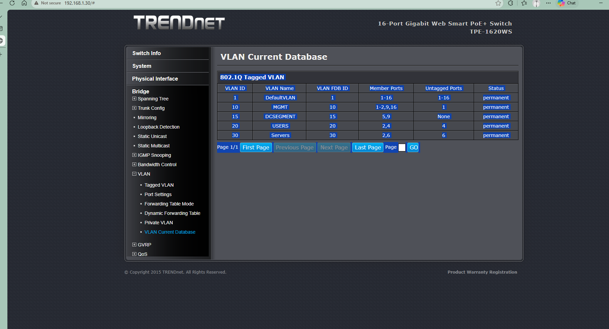
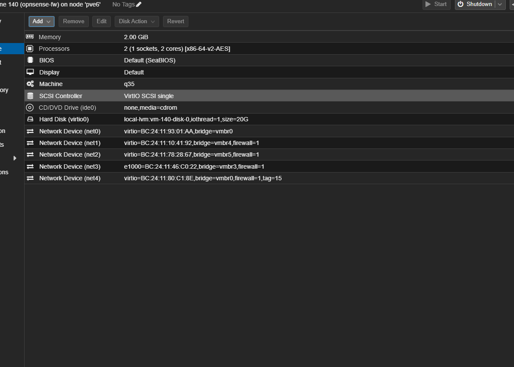
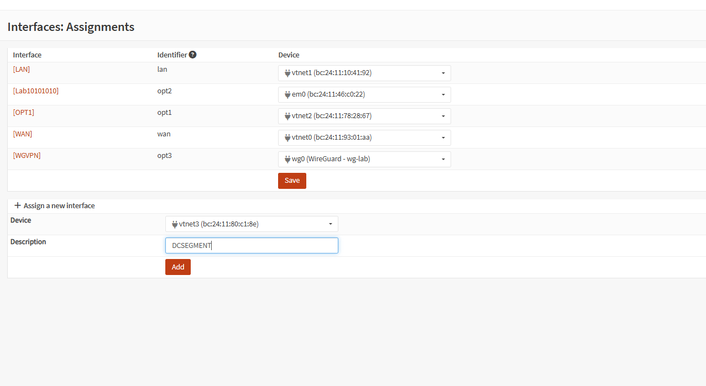
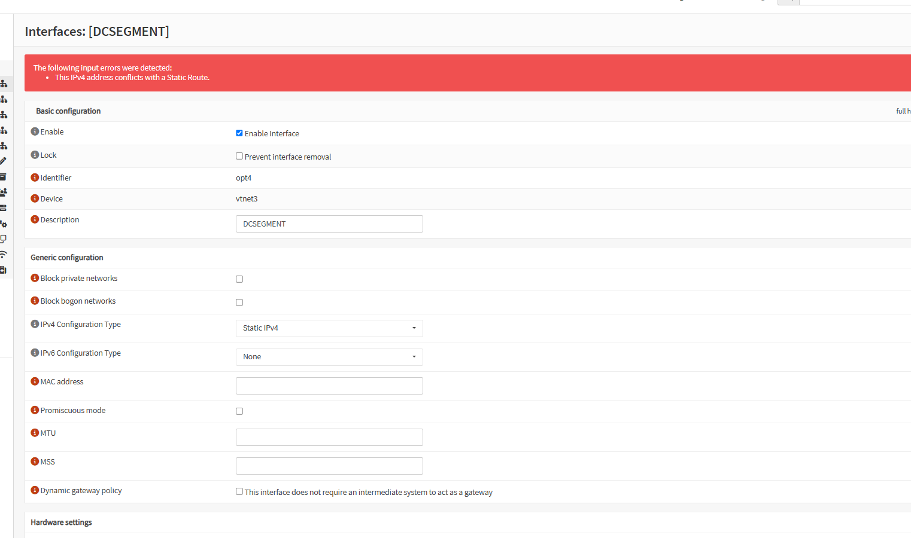
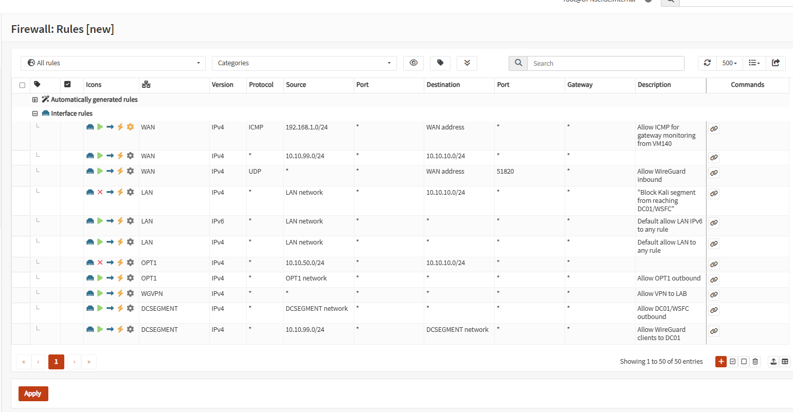
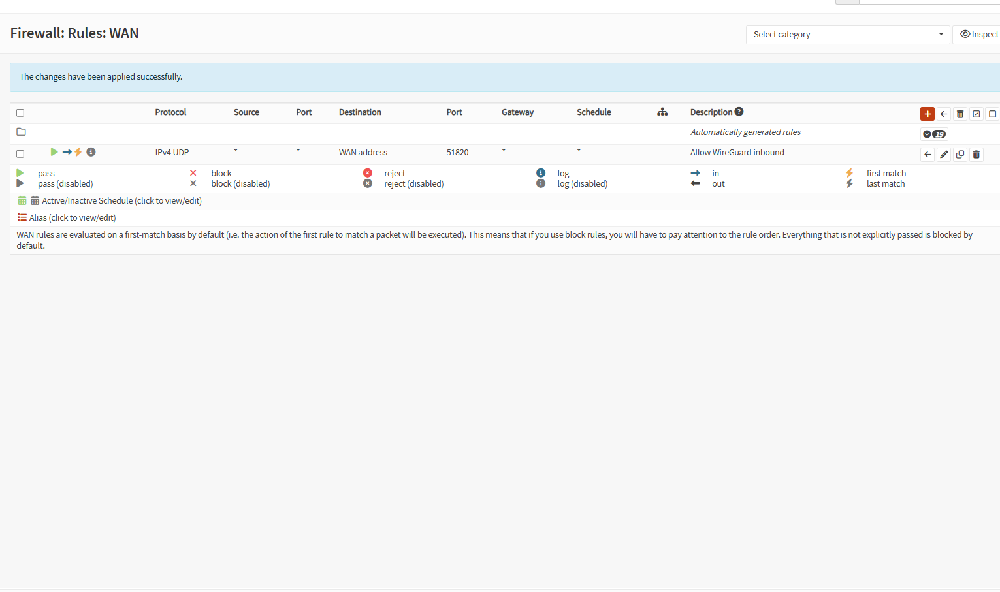
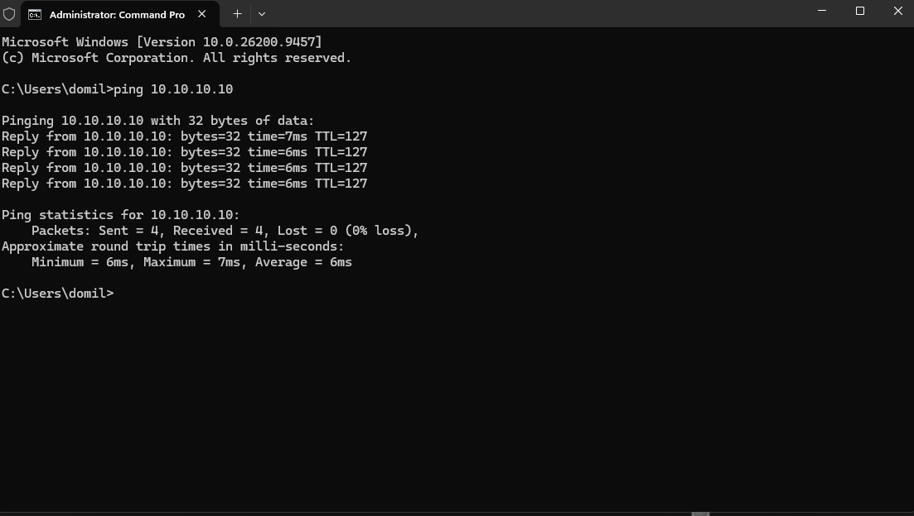
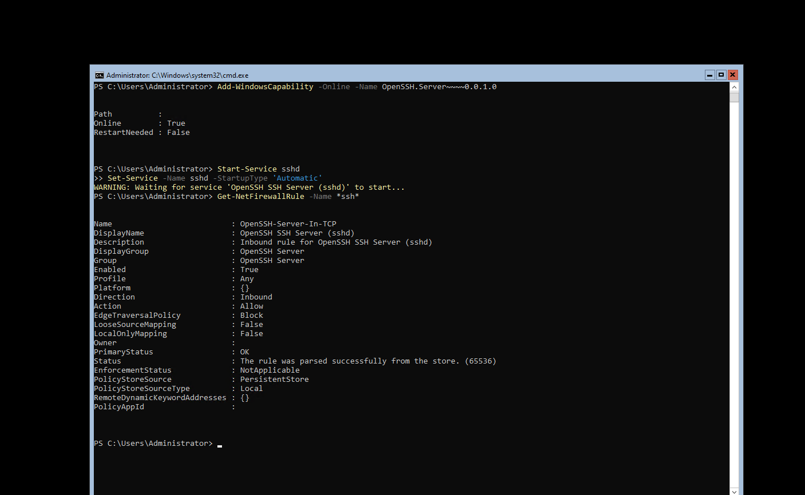
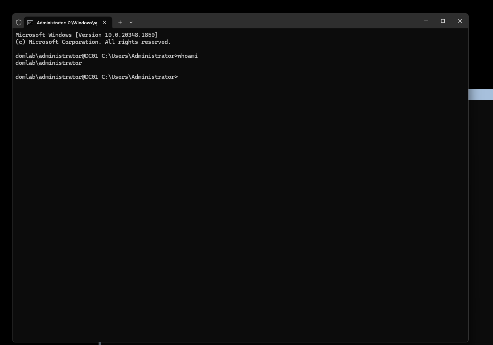

# DC01/WSFC Network Segmentation — Retiring a Stopgap Firewall with Proper VLAN Trunking

Part of the [opnsense-network-segmentation](../) project series. This one documents a full lifecycle: a temporary architecture correctly deployed to unblock a migration, and its proper retirement once the real missing capability was built to replace it.

## Background

The lab's domain controller (DC01) and Windows Server Failover Cluster (WSFC) nodes live on **pve1**, a Proxmox node in a 6-node cluster. Their network path originally ran through **OPNsense (VM 140)**, which also lived on pve1 at the time, using node-local Proxmox bridges.

When VM 140 was migrated to **pve6** (to consolidate the lab's security/AI attack-range tooling — Kali, Metasploitable2 — onto a single dedicated node), it lost access to those node-local bridges. Proxmox bridges don't span nodes automatically, so DC01 and the WSFC cluster were left with no reachable gateway.

**The stopgap:** a second OPNsense instance, **VM 141**, was built directly on pve1 to restore a local gateway for DC01/WSFC. This was the correct call at the time — no VLAN trunking existed yet across the physical switch fabric to let VM 140 (now on pve6) reach pve1's subnet directly. VM 141 unblocked the migration.

**The problem this created:** VM 140 and VM 141 ended up as two separate firewalls, each NAT'ing independently on the same flat 192.168.1.0/24 management LAN, with no routed relationship between them. Getting WireGuard-tunneled traffic (terminated on VM 140) to reach DC01 (behind VM 141) turned into a fight against OPNsense's gateway-monitoring (`dpinger`) marking cross-firewall routes as down, NAT rewriting source addresses unpredictably, and WAN-side default-deny rules silently dropping monitoring probes. Multiple fixes were attempted — static routes, "Do not NAT" outbound rules, WAN pass rules for ICMP monitoring — each addressing a real symptom, none resolving the underlying design conflict.

## Root Cause

The real gap wasn't a misconfiguration — it was that the physical switch fabric had no VLAN trunk carrying DC01's segment to the node where the firewall now lived. VM 141 was a legitimate way to route around that gap temporarily. It was never going to be a clean permanent fix, because it required two independent firewalls to agree on routing across a shared, unrouted LAN.

## The Fix: VLAN Trunking Instead of a Second Firewall

Rather than continue debugging the two-firewall NAT relationship, the fix was to build the missing piece — a tagged VLAN carrying DC01's segment from pve1 to pve6 — and let **VM 140 alone** be DC01's firewall, the same way it already handles the Kali and Metasploitable2 segments.

**New VLAN 15 ("DCSEGMENT")** was created on the TRENDnet access switch, tagged only on the two ports that actually needed it: port 5 (pve6, where VM 140 lives) and port 9 (pve1, where DC01/WSFC live). No other switch port needed the tag — DOMSW1 and the rest of the routed fabric have no reason to reach this segment directly, since VM 140 is meant to be the sole gateway in and out.

**VM 140** got a fourth network interface, bridged to the same physical NIC but tagged VLAN 15:

That interface was assigned inside OPNsense as a new logical interface, `DCSEGMENT`:

Configuring it as `10.10.10.1/24` initially failed — OPNsense flagged an IP conflict against a leftover static route from the abandoned VM 141 approach. This was a useful catch: it confirmed old config debris from the stopgap needed to be cleaned up, not just left in place.

With the conflicting route removed, the interface took the address cleanly, and firewall rules were added to allow DCSEGMENT outbound traffic and inbound access from the WireGuard client subnet:

Leftover rules from the VM 141 approach (a WAN ICMP-monitoring allow rule, a WAN pass rule for the old cross-firewall path) were removed as dead weight:

DC01's own network adapter was tagged into VLAN 15 on pve1 and rebooted to pick up the new path.

## Verification

Ping from a WireGuard-connected laptop to DC01, through VM 140's new DCSEGMENT interface — 0% loss:

SSH access required installing the OpenSSH Server feature on DC01 (it had never been installed — a separate, unrelated gap surfaced during testing) and confirming the inbound firewall rule was created:

Full end-to-end SSH session, authenticated as `domlab\administrator`, proving both network reachability and working domain authentication through the new path:

## Outcome

- VM 140 is now the sole firewall for DC01/WSFC, alongside its existing Kali and Metasploitable2 segments — one firewall, three isolated interfaces, consistent design across the board.
- VM 141 was decommissioned — its job is now done by proper VLAN trunking, the capability that was missing when it was first built.
- iSCSI traffic (previously sharing VLAN 10 with switch management traffic) was identified for the same treatment — a dedicated VLAN, separate from both management and domain traffic, following the same reasoning: keep storage I/O and broadcast domains isolated from unrelated traffic.

## Lessons Worth Keeping

- **A stopgap isn't a mistake — but it needs a defined retirement condition.** VM 141 was the right call when it was built. The mistake would have been leaving it in place indefinitely instead of recognizing, once VLAN trunking became available, that the original constraint no longer existed.
- **OPNsense's gateway-monitoring (`dpinger`) will silently disable a route** if it can't get ICMP replies from the gateway it's pointed at — even though the route still shows as present and correctly formed in the routing table (`netstat -rn`). A route that looks right but never gets used is a strong signal to check gateway status before anything else.
- **An IP-conflict error at interface creation is useful, not just an obstacle** — in this case it caught a real leftover artifact from the abandoned design that would otherwise have sat unnoticed.
